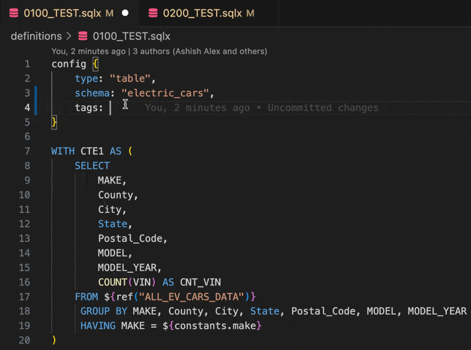
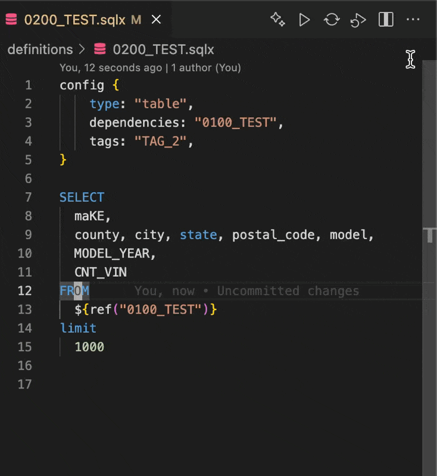

# Dataform tools - a vscode extension

[](https://github.com/ashish10alex/vscode-dataform-tools/releases)


⚠️ ***This is not an officially supported Google product.***


[VS Code extension](https://marketplace.visualstudio.com/items?itemName=ashishalex.dataform-lsp-vscode) for [Dataform](https://github.com/dataform-co/dataform) with following features


| Feature | Description |
|---------|-------------|
| [Dependancy graph](#depgraph) | Interative dependancy graph with external sources higlighted in distinct colors |
| [Inline diagnostics on `.sqlx` file](#diagnostics) ❗ | Native lsp like experience with diagnostics being directly put on both the sqlx file & compiled query |
| [Preview query results](#preview_query_results) | Preview query results in a table by running the file |
| [Go to definition](#definition) | Go to definition for source in `$ref{("MY_SOURCE")}`. Takes you to `MY_SOURCE.sqlx` or `sources.js` at the line where `MY_SOURCE` is defined |
| [Auto-completion](#autocomplete) | - declarations in `${ref("..")}` trigger when `$` character is typed <br><br> - Dependencies when `"` or `'` is typed inside the config block which has `dependencies` keyword is in the line prefix <br><br> - `tags` when `"` or `'` is typed inside the config block which has `tags` keyword is in the line prefix |
| [Code actions](#codeactions) | Apply dry run suggestions at the speed of thought |
| [Compilation & Dry run stats](#compilation) | - Live compiled query in a vertical split **on save** which is in sync with the current cursor position of your `.sqlx` file <br><br> - Data processed by query on bottom right on successful dry run |
| [Run file(s)/tag(s)](#filetagruns) | Run file(s)/tag(s), optionally with dependencies/dependents/full refresh using vscode command pallet / menu icons |
| [Format using Sqlfluff](#formatting) 🪄 | Fromat `.sqlx` files using [sqlfluff](https://github.com/sqlfluff/sqlfluff)|


## Requirements

1. [Dataform cli](https://cloud.google.com/dataform/docs/use-dataform-cli)

   `npm i -g @dataform/cli`

   Run `dataform compile` from the root of your Dataform project to ensure that you are able to use the cli

2. [Setup default application credentials for GCP](https://cloud.google.com/docs/authentication/provide-credentials-adc)


3. To enable formatting using [sqlfluff](https://github.com/sqlfluff/sqlfluff) install [sqlfluff](https://github.com/sqlfluff/sqlfluff)

   ```bash
   # install python and run
   pip install sqlfluff
   ```


4. To enable prettier diagnostics install [Error Lens](https://marketplace.visualstudio.com/items?itemName=usernamehw.errorlens) extension [ **optional** ]

> [!NOTE]
Trouble installing ? Please see [FAQ section](#faq), if you are still stuck, please [raise an issue here](https://github.com/ashish10alex/vscode-dataform-tools/issues)

## Features

### <a id="depgraph">Dependency graph</a>


### <a id="diagnostics">Inline diagnostics errors on `.sqlx` files ❗</a>


### <a id="preview_query_results">Preview query results</a>


### <a id="autocomplete">Autocomplete model, tags, dependencies</a>

Auto completion support for `dependencies` when `"` or `'` is typed inside the config block which has `dependencies` keyword is in the line prefix


Declarations in `${ref("..")}` trigger when <kdb>$<kdb> character is typed


Auto completion support for `tags` when `"` or `'` is typed inside the config block which has `tags` keyword is in the line prefix



### <a id="definition">Go to definition</a>
Go to definition for source in `$ref{("MY_SOURCE")}`. Takes you to `MY_SOURCE.sqlx` or `sources.js` at the line where `MY_SOURCE` is defined


### <a id="compilation">Compilation & Dry run stats</a>
Live compiled query in a vertical split **on save** which is in sync with the current cursor position of your sqlx file. Data processed by query on bottom right on successful dry run


### <a id="formatting">Formatting using sqlfluff</a>



### <a id="filetagruns">Run file/tag with dependencies/dependents</a>

Open vscode command pallet by pressing <kbd>CTLR</kbd> + <kbd>SHIFT</kbd> + <kbd>p</kbd> or <kbd>CMD</kbd> + <kbd>SHIFT</kbd> + <kbd>p</kbd> on mac and run one of the required commands

| Commands                                               |
|------------------------------------------------------  |
| `Dataform: Run current file`                           |
| `Dataform: Run current file with dependencies`         |
| `Dataform: Run current file with dependents`           |
| `Dataform: Run current tag`                            |
| `Dataform: Run current tag with dependencies`          |
| `Dataform: Run current tag with dependents`            |
| `Dataform: Format current file`                        |
| `Dataform: Run file(s) / tag(s) with options`          |


### <a id="faq">Frequently asked questions</a>

1. [Unable to execute command e.g. error]() `command vscode-dataform-tools.xxx not found`

   * It is likely that the vscode workspace folder is not opened at the root of your dataform project. For example, if your dataform project is located at `~/Documents/repos/my_dataform_project` ensure that workspace is opened at
   `~/Documents/repos/my_dataform_project` NOT `~/Documents/repos/my_dataform_project`
   * The above design is to facilitate the exection of `dataform compile --json` command without infering the dataform root at run time

2. [Error compiling Dataform, process existed with exit code 1]()
   * Check if correct dataform cli version is installed by running `dataform --version` in your terminal
   * Ensure that dataform cli version matches the version required by the project
   * Try compiling the project by running `dataform compile` on your terminal from the root of your dataform project
   * In case you need to install a specific dataform cli version by running `npm i -g @dataform/cli@2.9.0`. Make sure you verify the version by running the `dataform --version`
   * In case the error is not due to all the above reasons it is likely that you have a compilation error in your pipeline

3. [Dataform encountered an error: Missing credentials JSON file; not found at path <your_project_path>/.df-credentials.json]()
   * Run `dataform init-creds` from the from the root of your dataform project in your terminal
   * You will be promted to pick the location and type of authentication `json/adc`. Choosing adc will be use your default gcp credentials that you had setup using `gcloud`

3. [I do not want to see compiled query each time I save it]()
   * Open vscode settings and search for Dataform and uncheck the following setting
   

3. [I want the autocompletion to be of the format  `${ref('dataset_name', 'table_name)}` instead of `${ref('table_name')}` ]()
   * Open vscode settings and search for Dataform and select the prefered autocompletion format
   


## Known Issues

- [ ] Features such as go to definition / dependancy graph might not work with consistantly with `${ref("dataset", "table")}` or when it is multiline or a different format works best with `${ref('table_name')}` format

## TODO

- [ ] Bundle javascript files in the extension using [esbuild or webpack](https://code.visualstudio.com/api/working-with-extensions/bundling-extension)
- [ ] Handle case where user is not connected to internet or on vpn where network request for dry run cannot be made


